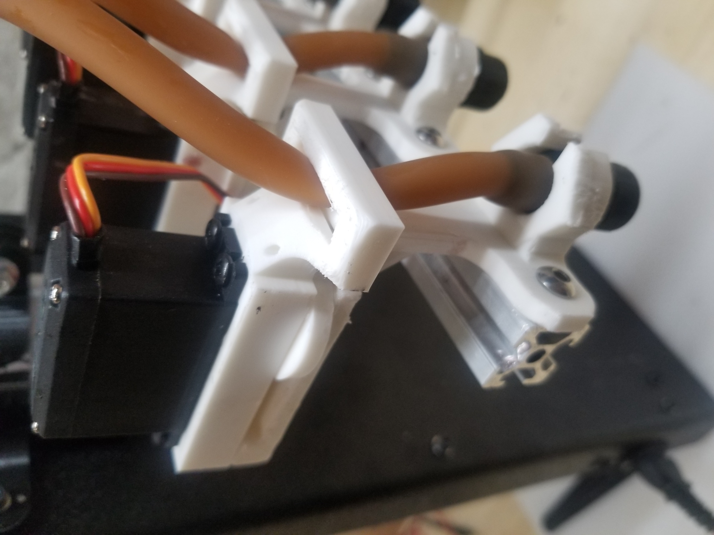

 L’autre projet secondaire sur lequel j’ai travaillé étais la conception et fabrication du prototype d’un appareil qui sert de plateforme de recherche pour cuisine moléculaire. Essentiellement, c’est juste un appareil qui forme des gouttes de liquide. La plateforme permet au client d’ajuster la vitesse et l’intervalle à laquelle les goutes sont formées et aussi de contrôler leurs grosseurs. Pour ce projet, j’ai fait la conception du système, la modélisation des composantes dont les valves motorisées, j’ai fait l’assemblage, la programmation, les tests et la calibration.

