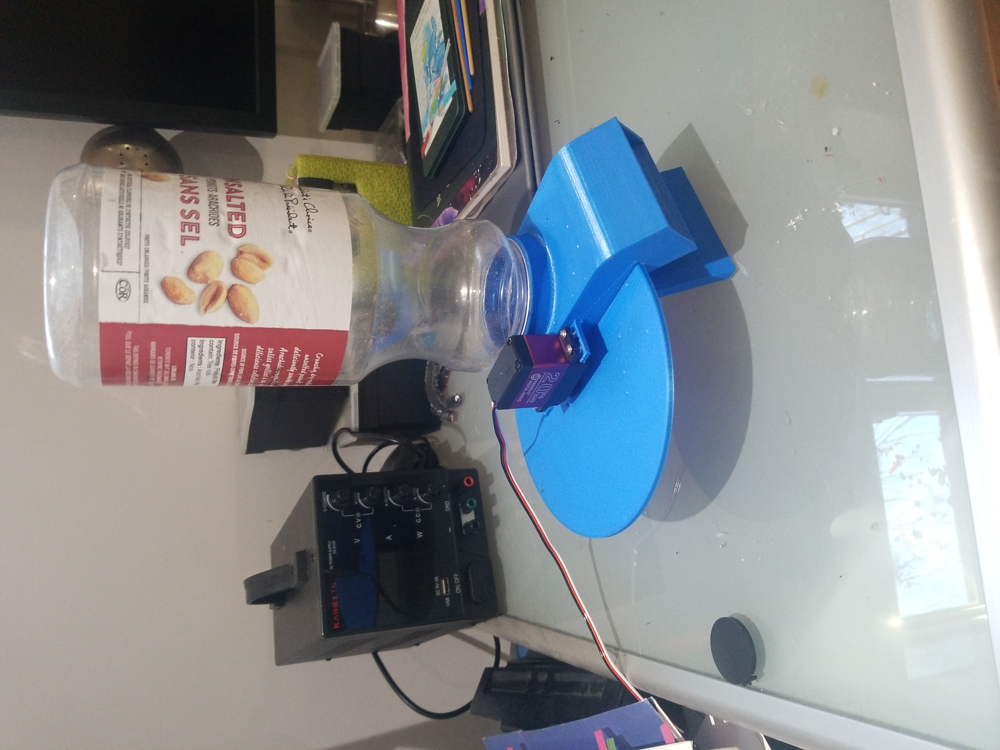

Ce projet est la conception d'un distributeur automatisé pour nourriture à chat. 

Le design est simple et efficace, mais n'offre pas une très bonne précision et ne comporte pas vraiment de protection contre l'eccès.

