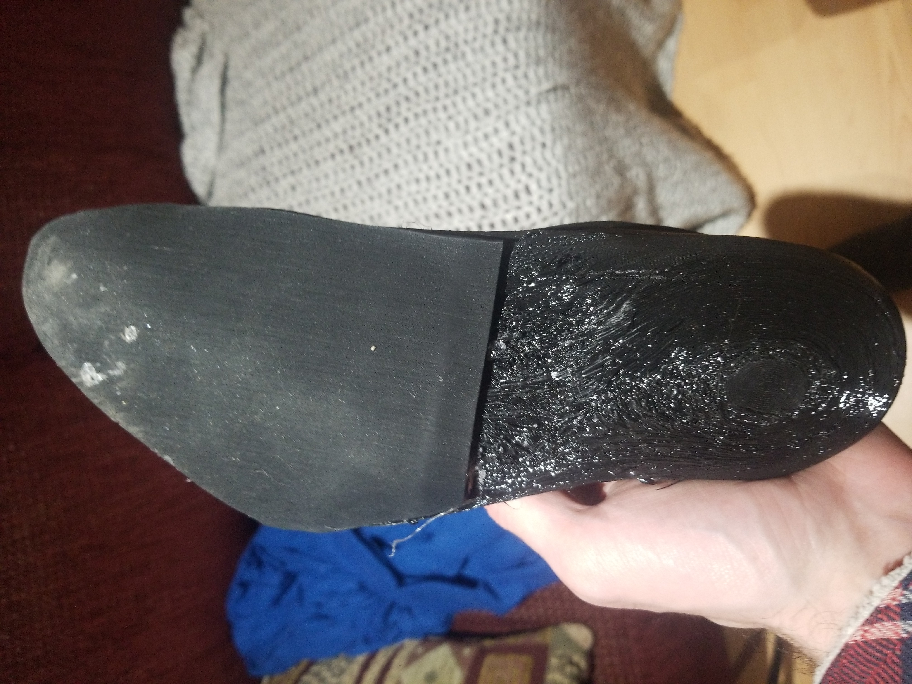
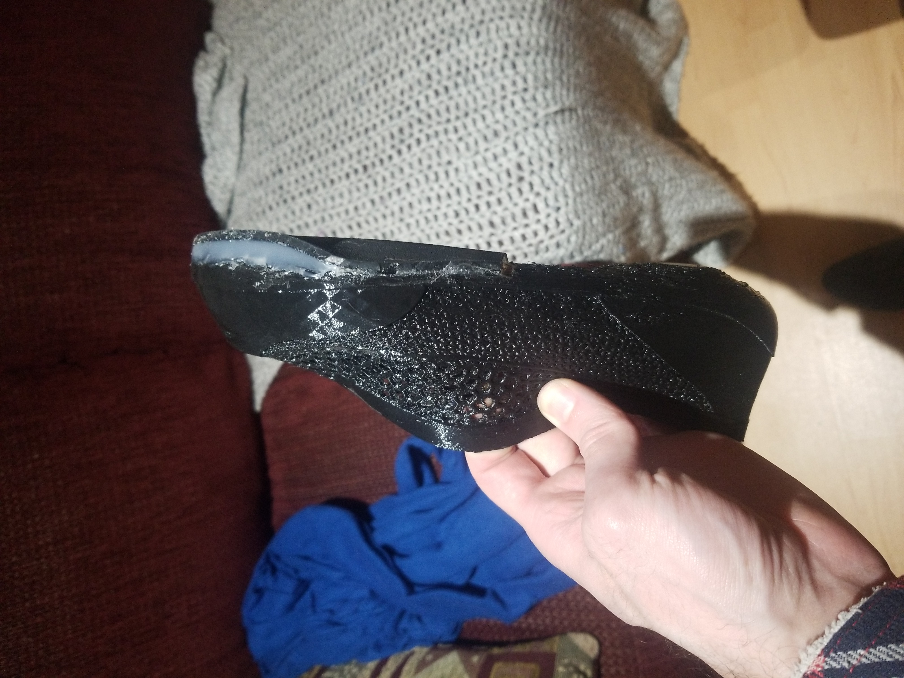
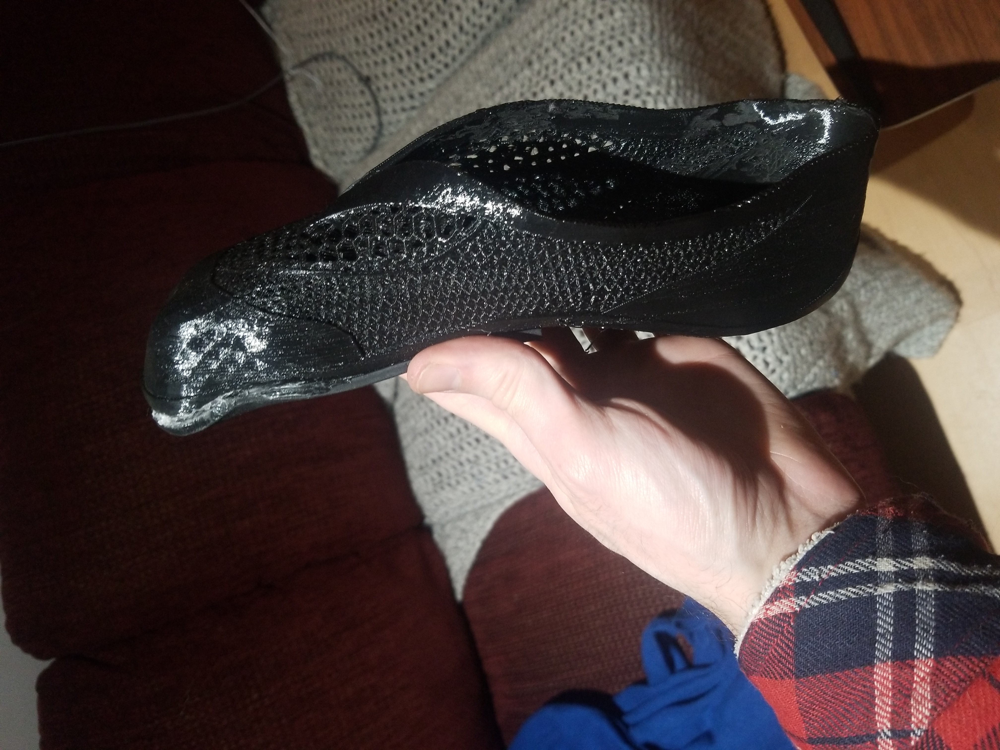

Suite à un nombre excessif d'heures à scanner modéliser et imprimé des souliers fait sur-mesure à mes pieds, puis un bon nombre de test de matériaux pour produire une semelle adhérente, je me suis finalement acheté des souliers d'escalade et mis de coté l'expérimentation. 

Le résultat était bien ajusté, mais pourtant extrèmement inconfortable. La forme extérieur était finalement convenable, mais les fichiers de models travaillés avec meshmixer était de plus en plus lourds et corrompus.

lors de la prochaine tentative, le modèle produit par le scan de mon pieds devrait être converti en modèle paramétrique pour arriver à former des géométries adéquates qui peuvent être précisément ajusté à chaque itérations. 

