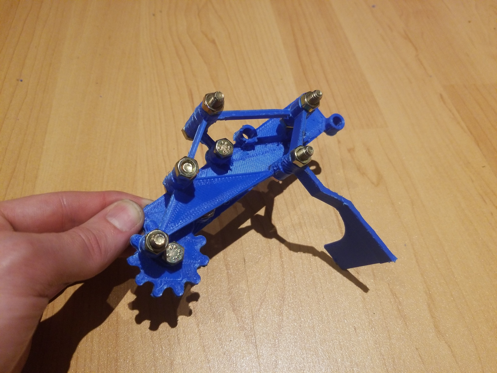

**Projet : Mécanisme à 4 barres pour la réduction du nombre d'actionneurs dans les applications de déplacement d'objet**

Ce projet vise à étudier la possibilité d'utiliser un mécanisme à 4 barres pour réduire le nombre d'actionneurs requis dans les applications de déplacement d'objets à hauteur fixe, comme dans les bras robotisés utilisés dans les chaînes de production.

Un robot cartésien à deux axes horizontaux et un axe de rotation a été conçu pour déplacer une pince au-dessus d'une table et ajuster son angle verticalement.

 ![[Figure 2  Schema du cas etudie et du robot utilise pour realiser la tache]]

Le mécanisme à 4 barres permet de réaliser un mouvement des doigts pour saisir et soulever un objet sans l'ajout d'un axe de mouvement vertical. La trajectoire des doigts doit suivre un parcours spécifique pour permettre la saisie, le soulèvement et le relâchement de l'objet.

![[Figure 3  Trajectoire des doigts]]

Un prototype en impression 3D a été réalisé à l'aide de la méthode de Zimmerman, prouvant la faisabilité de cette solution. Bien que le mécanisme obtenu soit volumineux et difficile à justifier par rapport aux solutions plus simples et polyvalentes, il est possible d'étudier cette solution plus en profondeur avec différents outils et méthodes numériques pour obtenir des trajectoires plus précises et un mécanisme plus compact et pratique.

 

